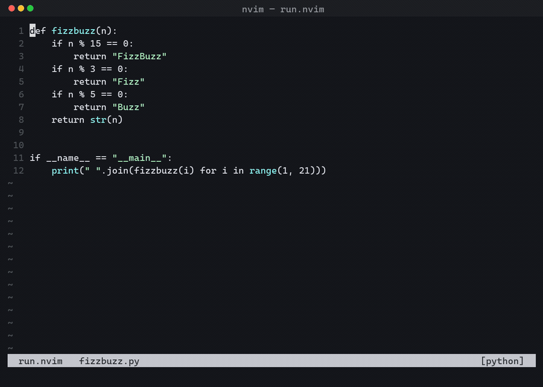

# run.nvim

Neovim's built-in Rust filetype plugin defines buffer-local `:Cargo`, `:Crun`,
`:Ctest` etc. commands that open a terminal split and run `cargo <args>`
whenever you edit a `.rs` file (see `$VIMRUNTIME/ftplugin/rust.vim` and
`autoload/cargo.vim`). It's built into Neovim itself, not a plugin.

run.nvim generalizes that same idea to other stacks: filetype-scoped
commands that run the right tool in a terminal split, with sensible defaults
and full config for adding your own languages.



`:Python` runs the current file, `:Ptest` runs `python3 -m pytest` — both in a
terminal split, both buffer-local to Python buffers.

## Defaults

| Filetype(s) | Commands |
| --- | --- |
| `python` | `:Python {args}` (defaults to running the current file), `:Ptest {args}` → `python3 -m pytest` |
| `javascript`, `javascriptreact`, `typescript`, `typescriptreact` | `:Npm {args}`, `:Node {args}` (defaults to current file), `:Ntest`, `:Ninstall` |
| `cs`, `fsharp` | `:Dotnet {args}`, `:Drun`, `:Dtest`, `:Dbuild` |

Each command accepts trailing arguments, e.g. `:Npm run dev`, `:Dtest --filter MyTest`,
`:Ptest -k test_foo`.

## Install (lazy.nvim)

```lua
{ 'tw4/run.nvim', opts = {} }
```

## Configuration

Pass a table to `opts` (or call `require('run').setup(opts)` directly) to
override or extend the defaults. Any language you omit keeps its default;
any language key you provide replaces that language's config entirely.

```lua
{
  'tw4/run.nvim',
  opts = {
    split = 'noautocmd new', -- how the terminal split is opened, see :help :new
    languages = {
      go = {
        filetypes = { 'go' },
        commands = {
          { name = 'Go', cmd = 'go', default_args = 'run %:p' },
          { name = 'Gtest', cmd = 'go test ./...' },
        },
      },
    },
  },
}
```

### Command spec

Each entry in `languages.<name>.commands` is a table:

- `name` (string): the `:UserCommand` name, buffer-local to matching filetypes.
- `cmd` (string): the base shell command.
- `default_args` (string, optional): used when the command is invoked with no
  arguments; supports `vim.fn.expand()` tokens like `%:p` for the current file.
- `nargs` (string|number, optional): passed to `nvim_create_user_command`'s
  `nargs`; defaults to `'*'`.

## License

MIT
